# SAP BTP - Hands-On Enblements Day - Cloud App developmemnt with SAP Business Application Studio

## Description

This repository contains the material for the SLB: SAP BTP  Hands-On Enablement Day (21.02.2025).

## Overview

Introduction to SAP Business Application Studio and how it accelerates app development with the incorporated sevices from SAP Business Technology Platform (BTP). Highlights on on key features and benefits for SAP partners and customers.
Wihin the current tutorial we will setup your SAP Business Application Studio, initiate a new project from Git, test it locally and deploy it on our dev environment running on SAP BTP Cloud Foundry. 


## Prerequisites

To complete the exercices in this repository, please make sure that you meet the following prerequisites:

* You have an [SAP Business Technology Platform (BTP) Trial Account](https://developers.sap.com/tutorials/hcp-create-trial-account.html).

## Accessing SAP Business Application Studio
To start developing and testing your CAP app, go to *Instances and Subscriptions* and choose “SAP Business Application Studio” 

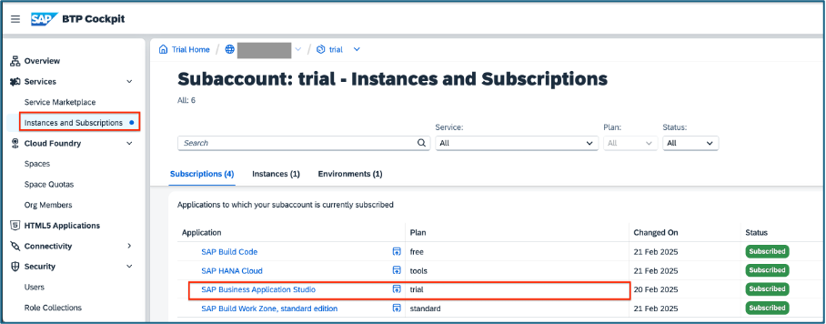


You should be redirected to the lobby in “SAP Build”. To access your cloud dev environment, click on the product switch and choose “Dev Space Manager”

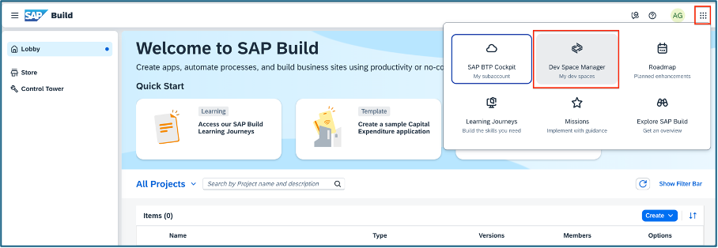


Check the box and click “OK” 
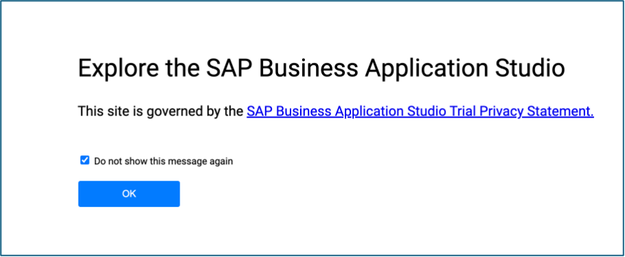


You will see the welcome message to SAP Business Application Studio. Now it’s time to create our pre-configured private dev environment (let’s say our virtual machine on the cloud). To do so, click on “Create Dev Space” 

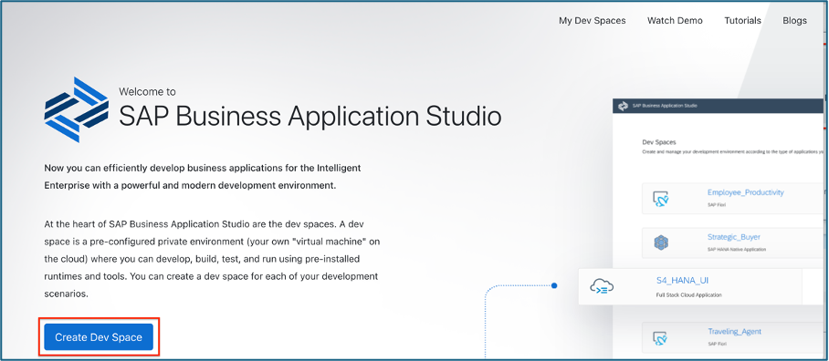


Let’s name our dev space: `playground` and specify that we would like to build “Full Stack Cloud Application” and click on “Create Dev Space”
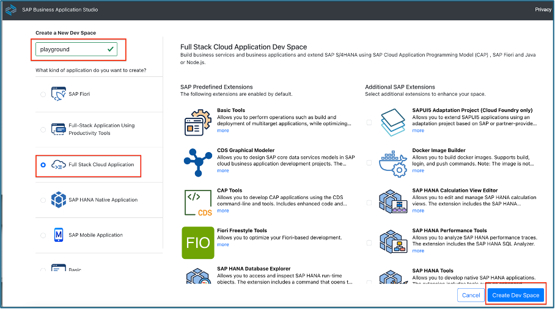


After the process of creation gets completed, please click on the dev space name to access your virtual machine on the cloud. 
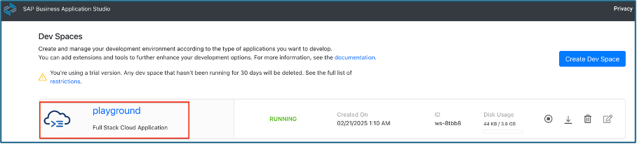


Soon you will be redirected to the Get Started with SAP Business Application Studio page, providing you with couple of options to initiate your project. Pick up *Clone from Git* 

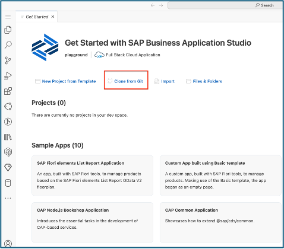


### Clone a projec from Git 

IMPORTANT!
This is the link to the repo which has been prepared in advanced demonstrating the capabilities of a sample CAP app. 
https://github.com/bisinho/cap-sflight-example.git 

Copy and paste it into Business Application Studio to clone the project from Git: 
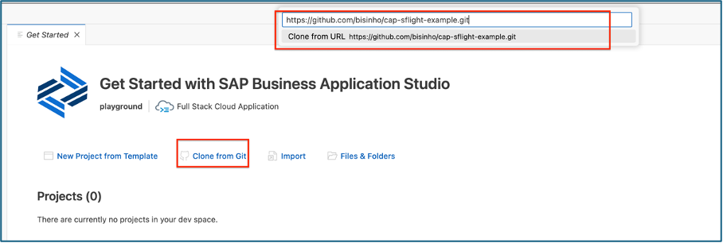


Click “Open” to review the repo that has been cloned. 
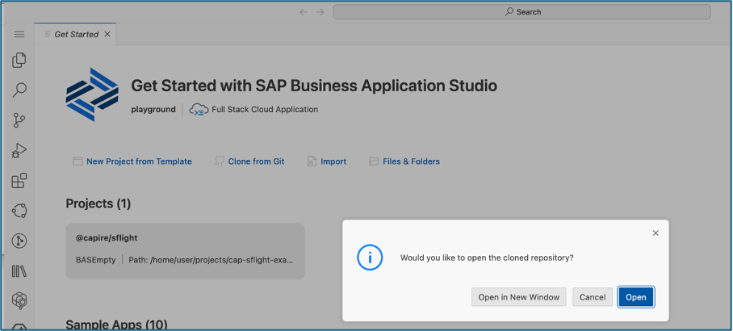


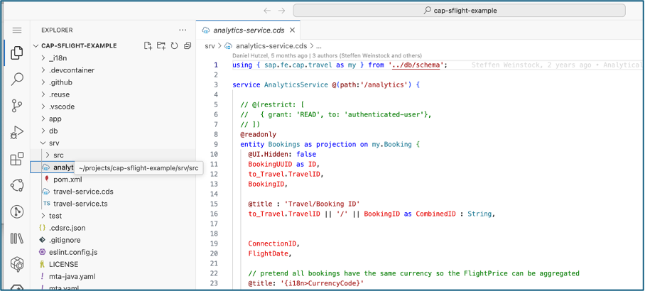


### Preview and test the CAP app locally 
To preview the app locally access the Business Application Studio terminal : 
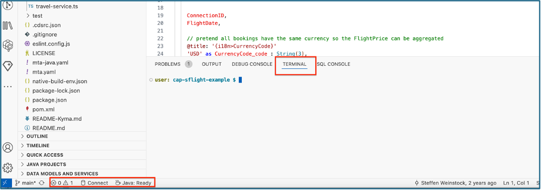


### Preview CAP app locally 

Once you have access to the terminal, assure, the folder is `cap-sflight-example`and run these commands: 

```
npm i -g @sap/cds-dk
```

and 

```
npm ci
npx cds-typer "*"
cds watch
```

After the execution of the command, you will see a popup message directly in Business Application Studio – “A service is listening to port 4004”. Click on “Open in a New Tab” to preview your application on your machine on the cloud. 

You will land at your sap/cds server and BAS delivers built-in UI module to preview your app. 

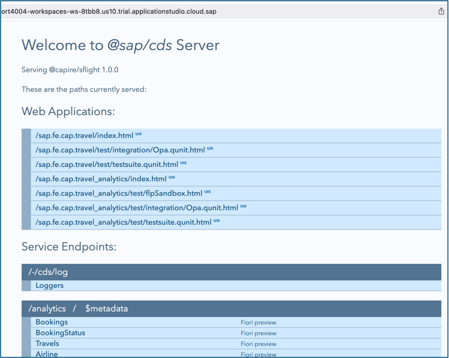


In you click on `/sap.fe.cap.travel/index.html` you could preview the app and how it interacts with the DB data and the requests related to it.

Everything looks good, so we are confident to proceed with an app deployment to our test environment. 

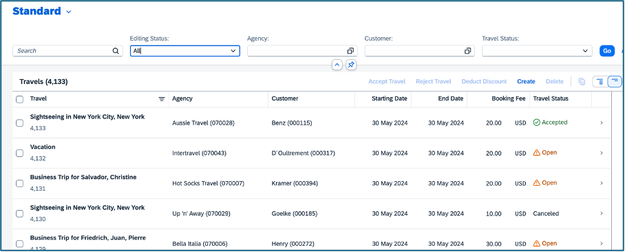


### Deploy CAP app with MTA Deploy Service 
Prerequisites: Login to Cloud Foundry. 
You will need to login to CF from the Business Application Studio. To do so, go to the search and type `> CF: Login to Cloud Foundry`  and then click on this option. 

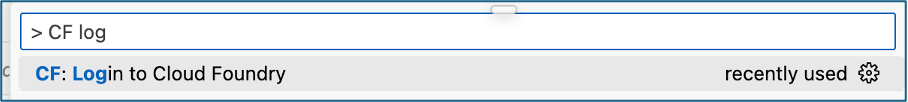


Provide your credentials and navigate to the CF space where you would like to deploy the application and click on the “Apply” button. 
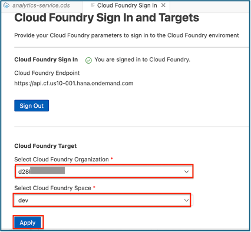


Now, we can benefit out of MTA Deployment Service directly from the Business Application Studio. To do so there are just two simple steps: 
-	Build MTA archive – just navigate to the `mta.yaml` file, right click on it and choose: “Build MTA Project”

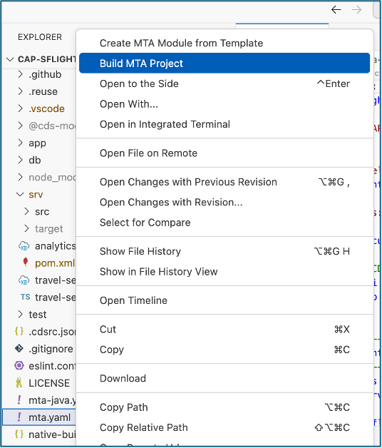


-	After a successful completion of the build, navigate to folder `mta_achives` and look for the `.mtar` file. Right-click on it and choose “Deploy MTA Archive” 

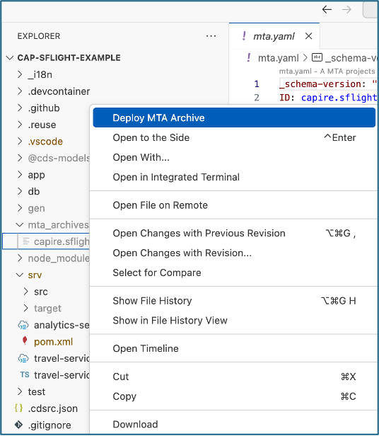


This task will trigger a deploy to the desired CF space and all related CAP app dependencies (e.g. `hdi-container`, `xsuaa` ) will be created by the MTA service. 

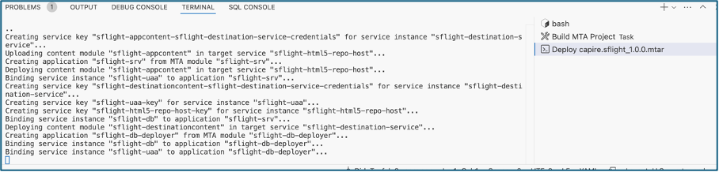


The deploy task shall be completed successfully. 
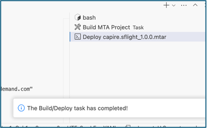


### Validation of CAP app deployed 

Go to your subaccount and access the CF space you have created. You should see two CF apps: 

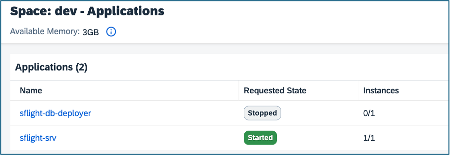


Note: `sflight-srv` is the app backend, while `sflight-db-deployer` it is the module to import the data into the hdi-container and by design shall be in state “Stopped”. 

Now, let’s check out the FE of your app: go to the subaccount level and click on “HTML5 Applications” menu item. 

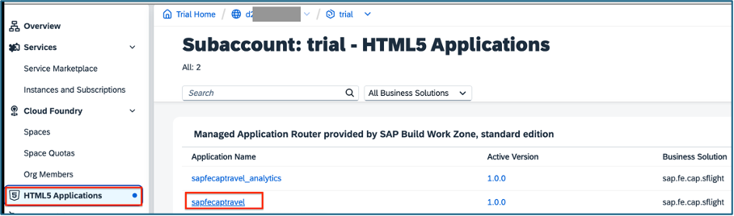


Well done - you will see the UI and the data served by the HANA Cloud in your browser! 


 
## Summary: 

