# Exercise 1 - Create a Job in the SAP Continuous Integration and Delivery service

In this exercise, you will set up SAP Continuous Integration and Delivery and, in the service, create a job.

## Exercise 1.0 - Set Up SAP Continuous Integration and Delivery

### Subscribe to SAP Continuous Integration and Delivery

1. In BTP Cockpit navigate to your subaccount.
1. Then navigate to **Services** → **Service Marketplace**.
1. Search for `continuous` in the search field.
1. Click on the three dots (**...**) on the **Continuous Integration & Delivery** tile and click on **Create**.

   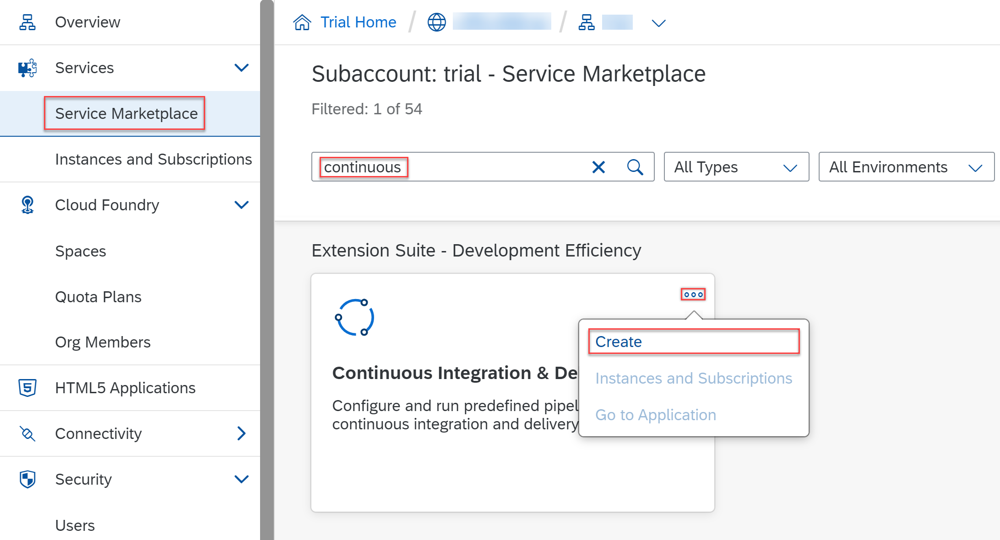

   > **Note:** If you don't see the **Continuous Integration & Delivery** tile when you search for it, please go back to [Exercise 0.1](../ex0/README.md#exercise-01---optional-add-the-required-entitlements) for adding the correct entitlements first and then come back.

1. In the **New Instance or Subscription** pop-up, leave the default settings and choose **Create**.

### Add the Required Permissions

1. In your subaccount in the SAP BTP cockpit, navigate to **Security** → **Users**.
2. click on the arrow **>** next to your user entry.

   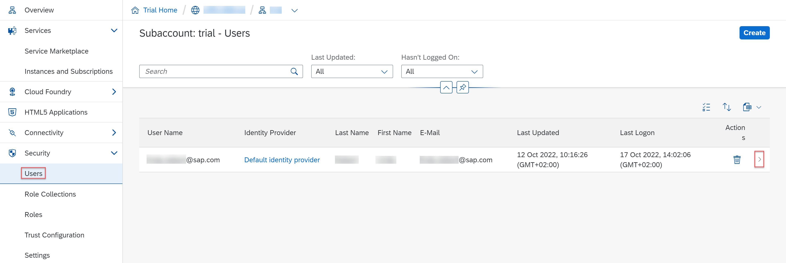

3. In the **Role Collections** overview of your user entry, click on **Assign Role Collection** or, if the button is not visible, click the three dots (**...**) and choose **Assign Role Collection**.

   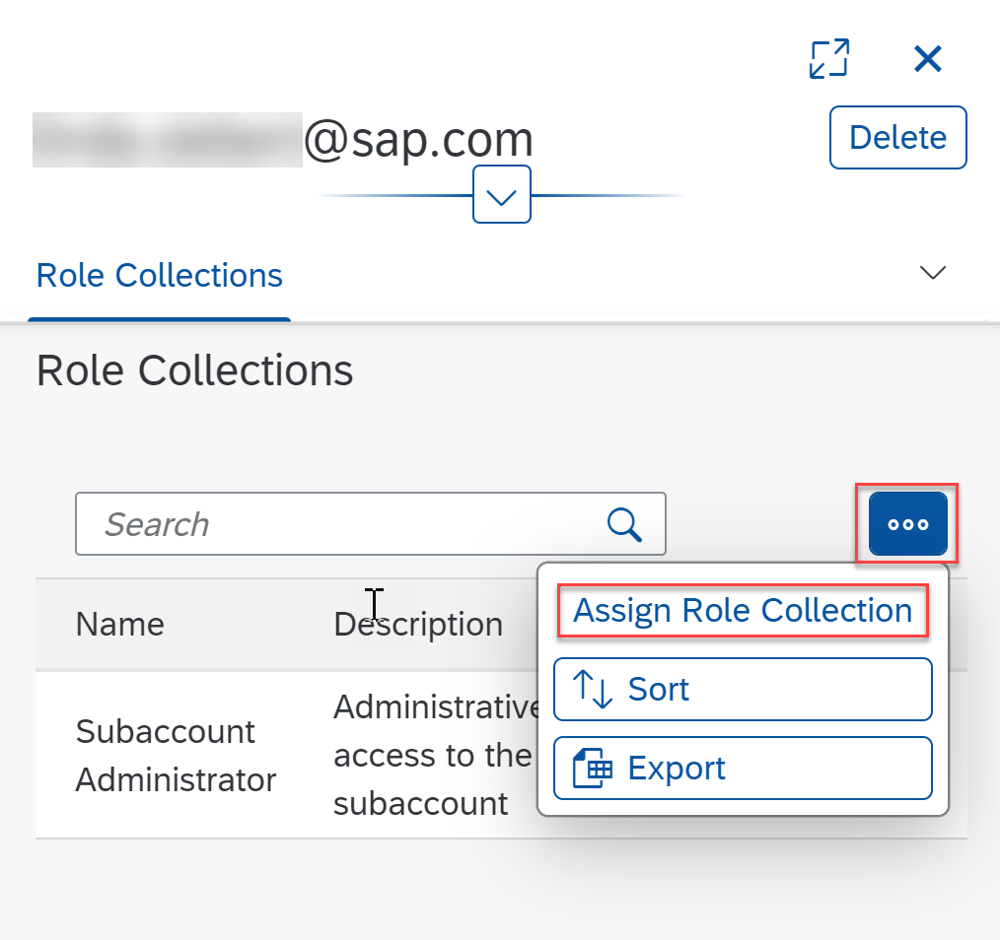

4. Check the boxes for **CICD Service Administrator** and **CICD Service Developer**, then click **Assign Role Collection**.

   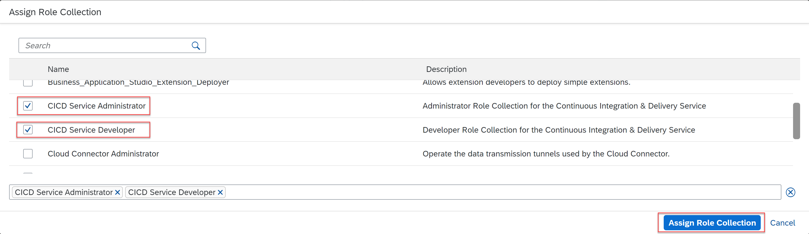

### Open the Continuous Integration and Delivery Service

1. In your subaccount in the SAP BTP cockpit, navigate to **Services** → **Instances and Subscriptions**.

   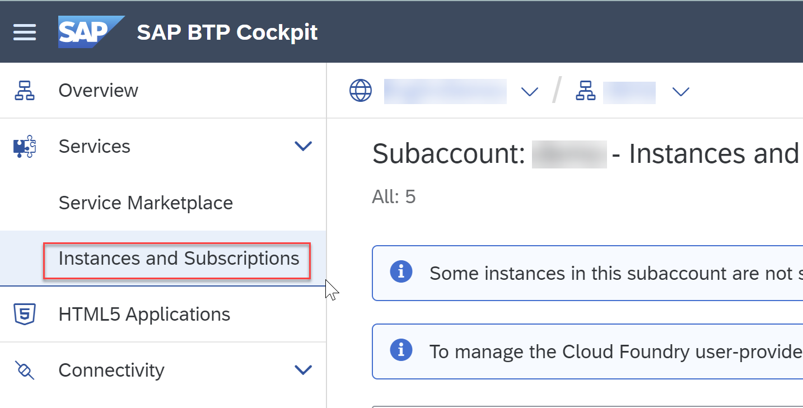

2. In the **Subscriptions** overview, click on the link **Continuous Integration & Delivery**.
Now, the user interface of SAP Continuous Integration and Delivery opens.

   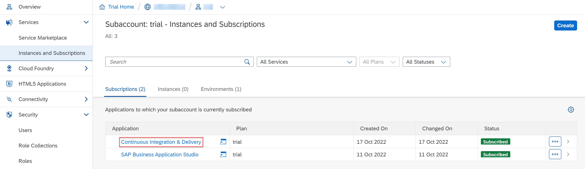

> **Note:** If you get an authorization error when trying to access the service, please log out of the service and log back in again.

## Exercise 1.1 Add Your Repository to SAP Continuous Integration and Delivery

Connect SAP Continuous Integration and Delivery with the repository in which your sources reside.

1. In SAP Continuous Integration and Delivery, navigate to **Repositories** and click on **+** _(Add)_.

   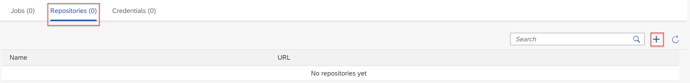

2. In the **Add Repository** view, give your repository a **name**. For example `cap-sflight`.

3. In GitHub, copy the HTTPS clone URL of the repository you just created in [Exercise 0](../ex0#exercise-00---create-a-copy-of-this-repository).

   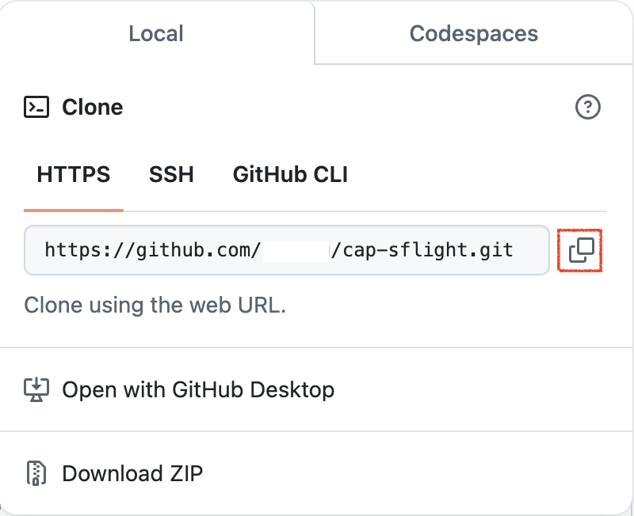

4. Paste it into the **Clone URL** field in the **Add Repository** pop-up in SAP Continuous Integration and Delivery.

5. Leave the rest of the fields empty.

6. **Remove** the Webhook Event Receiver. This is optional and can be added later as described in [Exercise 1.3](#exercise-13-optional-create-a-webhook).

7. Click on **Add**.

   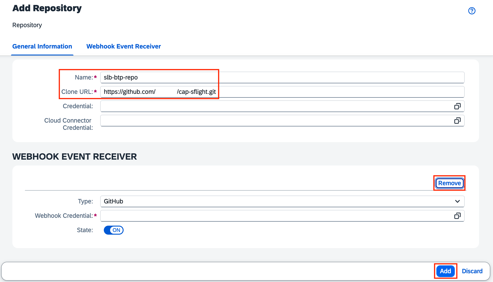

## Exercise 1.2 Create and Trigger a Job in SAP Continuous Integration and Delivery

1. In SAP Continuous Integration and Delivery, go to the **Jobs** tab and click on **+** _(Create job)_.

   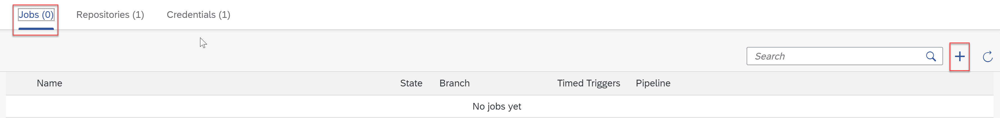

2. In the **General Information** section of the **Create Job** pane, enter the following values:
   - **Job Name**: Freely choose a unique name for your job. We recommend using a name that contains both your GitHub project name and branch.
   - **Repository**: Select the repository you just created (if not already selected).
   - **Branch**: Enter `main`.
   - **Pipeline**: Keep the default **SAP Fiori in the Cloud Foundry environment**.

3. In the **Stages** section, keep the default **Job Editor** as **Configuration Mode**.

4. In the **Build** section, Keep **mta** as **Build Tool** and choose **Java 21 Node 20** as **Build Tool Version**.

   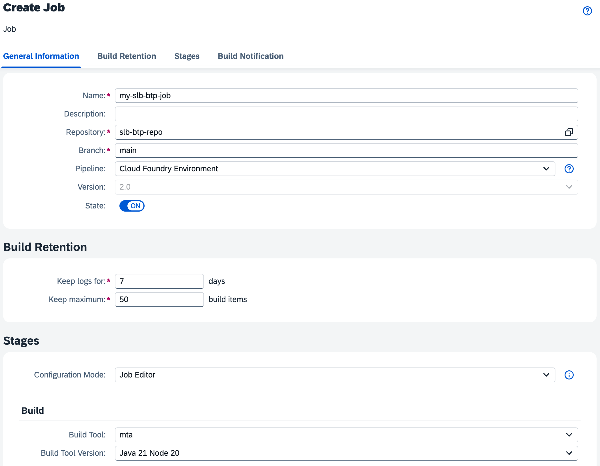

5. Click on **Create**.
   You've successfully created your first CI/CD job with the Build stage enabled.

6. Trigger a build of your job, by clicking on **Run**.

   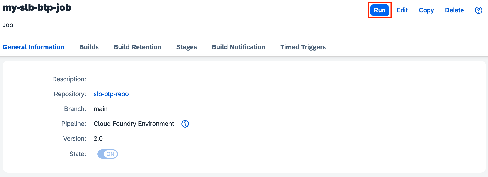

7. The successful build looks like the following.

   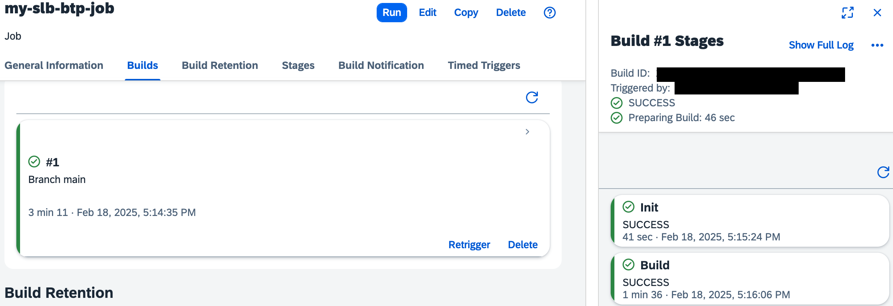

## Exercise 1.3 (Optional) Create a Webhook

You can configure a webhook for your repository, which automatically triggers a build of your job when there is a change commit in the source code repository.

1. In the **Repositories** tab in SAP Continuous Integration and Delivery, choose your newly created repository, then choose **Edit**.

   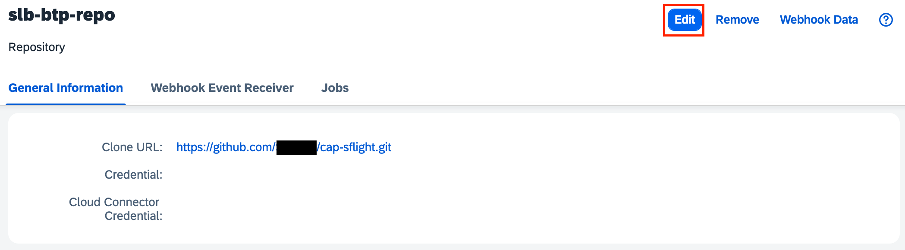

2. **Add** a new Webhook

   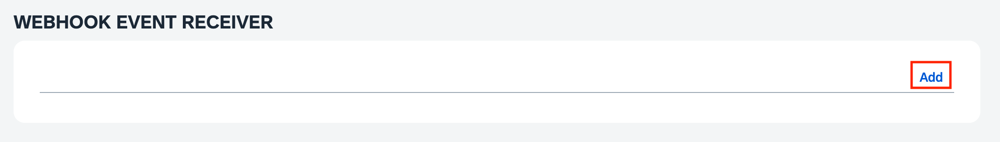

3. Keep the settings and click the value help button of **credentials**.

   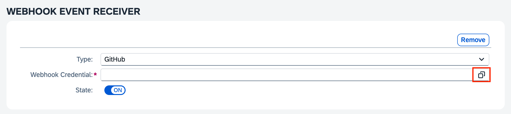

4. As a result, the Credentials pop-up opens. **Add** a new credential.

   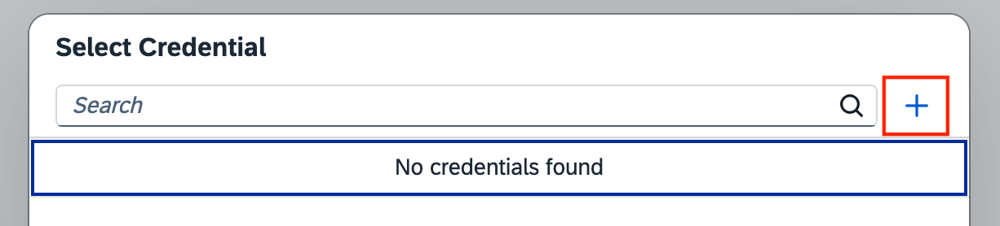

5. In the new pop enter any credential **Name** and **generate** a **Secret**. Make sure you note down the credentials as it is needed to finish the webhook setup in GitHub. Confirm with **Create** and **Save** the repository settings.

   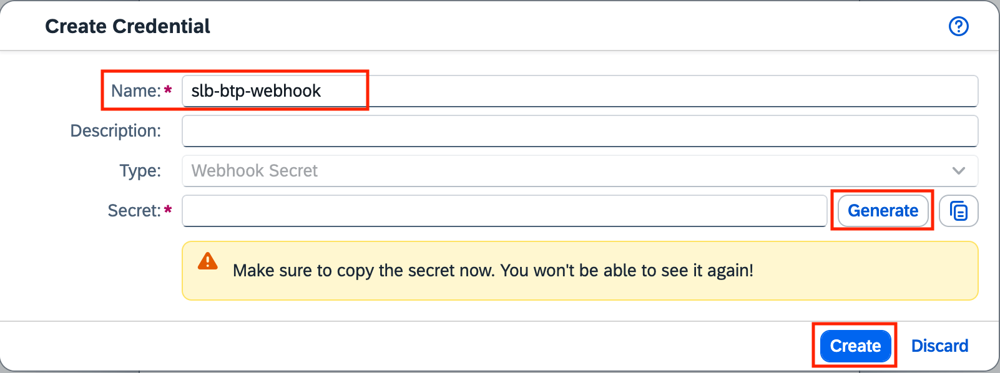

6. On the top right corner **open** the repository **Webhook Data**.

   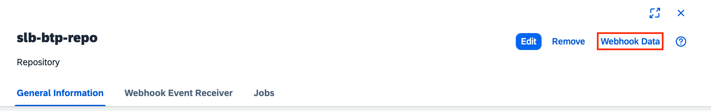

7. Note down the **Payload URL**, then click on the link to your GitHub repository.

   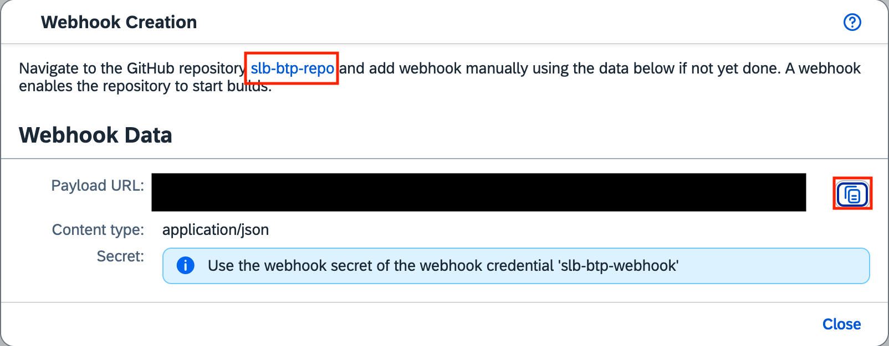

8. In your project in GitHub, go to the **Settings** tab.

9. From the navigation pane, open **Webhooks**, then click on **Add webhook**.

10. Enter the **Payload URL**, **Content type**, and **Secret** from the **Webhook Data** pop-up in SAP Continuous Integration and Delivery. For all other settings, leave the default values.

11. Click on **Add webhook**.

   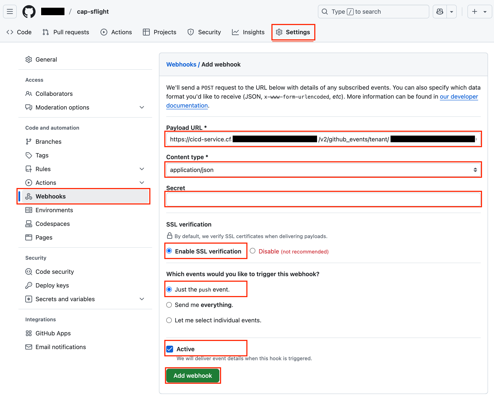

## Summary

Congratulations! You've now set up SAP Continuous Integration and Delivery, added your GitHub repository to the service, and created and triggered your first CI/CD job.

Continue to - [Exercise 2 - Set up SAP Cloud Transport Management](../ex2/README.md)
