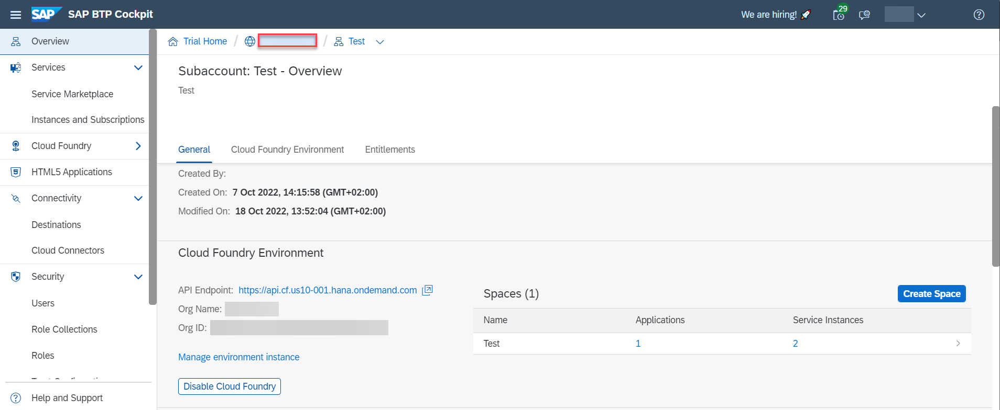
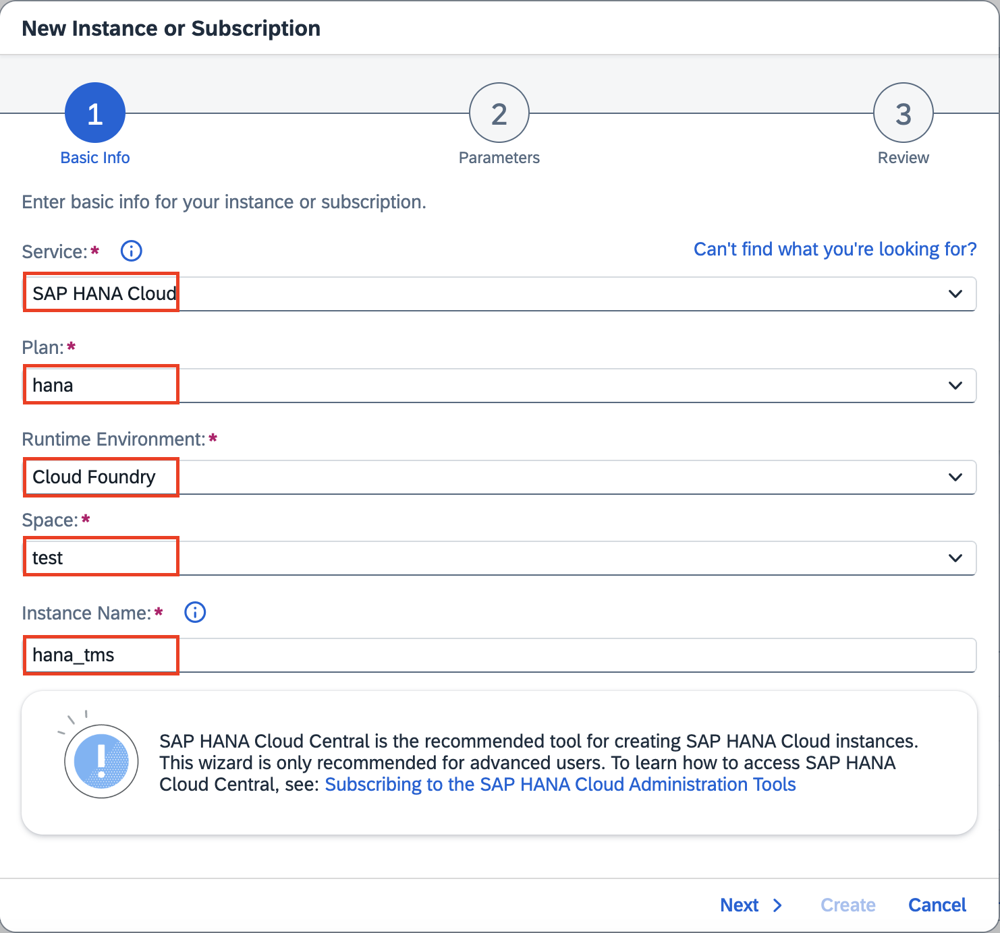
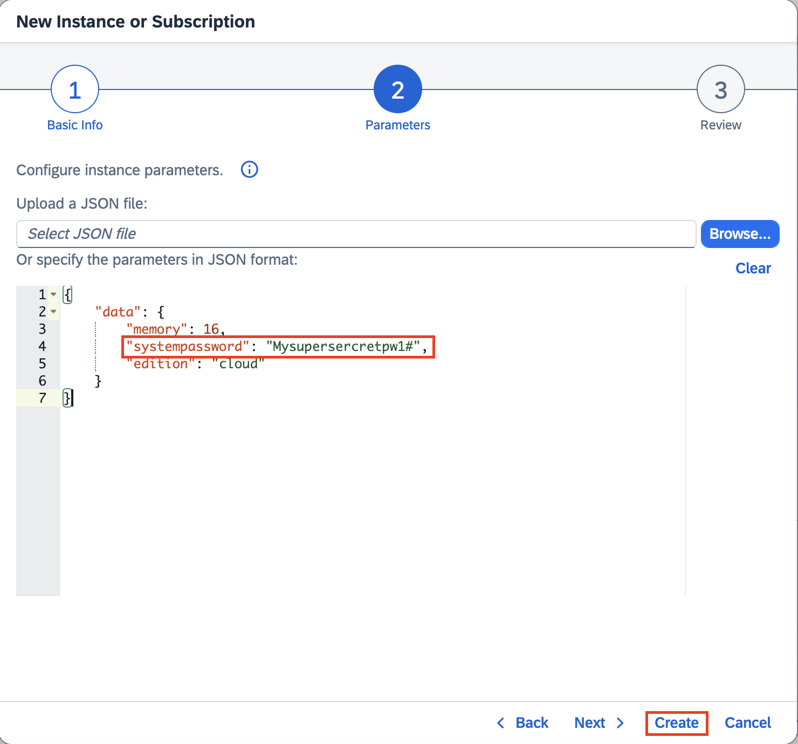
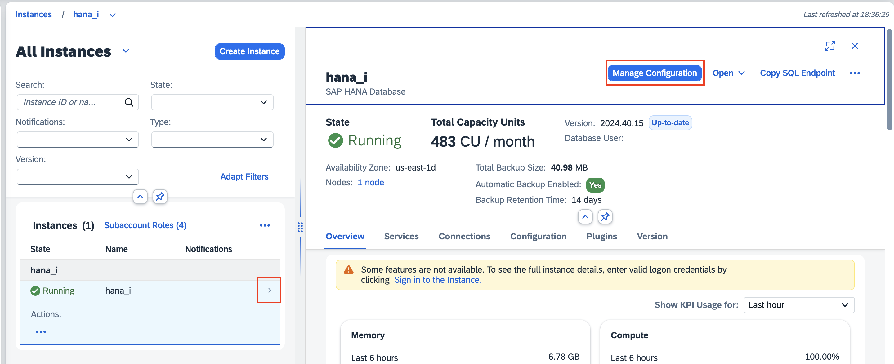
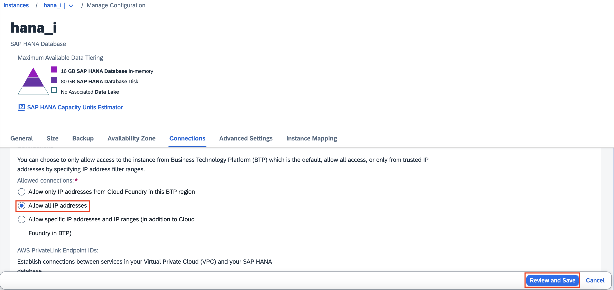

# Exercise 2 - Set up SAP Cloud Transport Management

In this exercise we will set up SAP Cloud Transport Management service so that it can be used to perform imports of transport requests created by the SAP Continuous Integration and Delivery service. This setup consists of the following steps:

- Create one additional subaccount which act as targets for the imports
- Subscribe to SAP Cloud Transport Management
- Create a role collection and assign it to your user
- Create an instance of Cloud Transport Management service and a service key
- Create destinations for deployment
- Create transport nodes and routes

## Exercise 2.0 - Create Target Subaccounts for Transport

### Create the Test Subaccount

1. Go to the BTP cockpit of your SAP BTP trial account (global account) to the **Account Explorer**  tab.
2. You should see (at least) one subaccount called **Trial**, which was created when your trial account was set up.
3. You will now create two additional subaccounts that will be used as targets for transporting with SAP Cloud Transport Management.
4. Choose **Create -> Subaccount**.
5. Enter a **Display Name** of your choice, for example *Test*.
6. Enter a **Subdomain** name. Please note that this name must be unique in your region. The input screen provides you with a proposal when you start typing in the **Display Name** field. Accept this proposal.
7. As **Region** choose the region of your trial account.
8. Choose **Create**.
9. The creation of the subaccount takes a few seconds.
10. Click on the new tile.
11. On the **Overview** tab click on **Enable Cloud Foundry**.
12. Leave the **Plan** set to **trial**.
13. You can leave the **Instance Name** as it is.
14. The **Org Name** becomes part of the URL to be used in the destination to deploy content to this subaccount. So you might want to make it a little shorter as the proposal which is created from a combination of global account name and the subdomain name. It must be unique, though. Since the subdomain name has to be unique, too, you could use it as **Org Name** as well (remove the *global account name* part).
15. Choose **Create**.
16. After a few seconds the Cloud Foundry Environment is set up.
17. Click on **Create Space**.
18. Choose a **Space Name**, for example *Test*.
19. Make sure that your user gets the roles **Space Manager** and **Space Developer** assigned. This is the default.
20. Choose **Create**.
21. Go back to the **Account Explorer** view of your trial account by clicking on its name in the breadcrumbs on the top of the screen (next to the globe icon).

    

### Redistribute Cloud Foundry Entitlements Among Your Subaccounts

To run our demo application within the Cloud Foundry runtime, it is needed to assign additional entitlements. This is necessary for all subaccounts to which the [app](https://github.com/SAP-samples/cap-sflight) will be deployed. In the trial environment the initial subaccount (called *trial*) receives all available entitlements by default. As a first step, the Cloud Foundry Runtime Memomry needs to reassgined.

1. Go to the BTP cockpit of your global trial account holding the three subaccounts.
2. Navigate to **Service Assignments** (to be found under **Entitlements**).
3. Select **Cloud Foundry Runtime** from the drop-down 'Service'. You will see that all 4 units are assigned to one subaccount.
4. Navigate to **Entity Assignments** and click on the selector icon under **Select Entities**.
5. Select the subaccount holding the four Cloud Foundry entitlements and choose **Select**.
6. Choose **Edit**.
7. Scroll down to **Cloud Foundry Runtime** and use the minus (**-**) sign to reduce the number of Units to two (**2**) .
8. Scroll up again and choose **Save**.

Now assign all remaining entitlements to the **Test** subaccount

1. After saving is completed use the **Select Entities** field again to deselect the **trial** subaccount and select the **Test** subaccount.
2. Choose **Select**.
3. Choose **Edit**.
4. Choose **Add Service Plans** and add the following entitlements:

| Service                                      | Plan                   | Assignment |
| :------------------------------------------- | :--------------------: | ---------: |
| Cloud Foundry Runtime                        |  Memory                | 2          |
| SAP HANA Cloud                               |  hana                  | 1          |
| SAP HANA Cloud                               |  tools (Application)   | 1          |
| SAP HANA Schemas & HDI Containers            |  hdi-shared            | 1          |
| Auhtorization and Trust Management Service   |  application           | 1          |
| SAP Build Work Zone, standard edition        |  standard (Application)| 100        |

### Create Subscriptions and Instance in your Test Subaccount

For the application to run after the transport, you need to provide a SAP Hana Cloud hana db instance, a SAP Build Workzone subscription (Needed to access the frontend of the app) and a SAP Hana Cloud tools subscription (Needed to configure the hana db).

1. In your Test subaccount, go to **Instances and Subscriptions**.
2. Click **Create** to open the **New Instance or Subscription** poppup.

 

First create all required subscription.

1. Choose a subscription for **SAP Build Workzone, standard edition** via the Service drop down field.
2. Choose the **Plan** **standard** and **Create** the subscption
3. In the next step, open the **New Instance or Subscription** popup again and choose **Service** **SAP HANA Cloud**.
4. Choose the **Plan** **tools** and **Create** the subscption.

As a last step create the **SAP HANA Cloud** hana instance. As SAP Hana Cloud Trial are limited to have only one hana instance per subaccount, please make sure every other instance in any other subaccount has been deleted.
You can check your trial global account all **Service Assignments** of  **SAP HANA Cloud*, which gives you an indicator of which subaccounts need to be checked. 
Check if in any metioned subaccount any active instance of hana exists and delete the instance.

 

5. Finally in your **Test** subaccount, open the **New Instance or Subscription** poppup again and choose **Service** **SAP HANA Cloud**:
6. Choose within the **Plan** drop down the **hana** instance and fill all manadatory input fields, e.g.:

 

7. Go to parameters and proide a **systempassword**. The password must comply with the default SAP HANA password policy. It must have at least 8 characters and comprise at least one uppercase letter, at least one number, and at least one lowercase letter.

 

8. **Create** the hana instance

The creation of the Hana instance will take some minutes. Please continue with the next step.

## Exercise 2.1 - Enable SAP Cloud Transport Management for Use

### Subscribe to SAP Cloud Transport Management

The subaccount which has been created automatically when creating the BTP trial account (called *trial* by default) has all necessary entitlements for enabling SAP Cloud Transport Management. We will use this subaccount for the exercise.

If you want to use another subaccount to enable Cloud Transport Management you have to first make sure that the necessary entitlements are available. Please see the documentation: [Configuring Entitlements to Cloud Transport Management](https://help.sap.com/docs/TRANSPORT_MANAGEMENT_SERVICE/7f7160ec0d8546c6b3eab72fb5ad6fd8/13894bed9e2d4b25aa34d03d002707f9.html) in that case.

1. Open the BTP cockpit of your trial account.
2. In the **Account Explorer** view click on the tile called **trial**.
3. Open the **Service Marketplace**. It can be found in the **Services** area in the navigation pane.
4. In the Search field enter `Transport`.
5. Click on the **Cloud Transport Management** tile.
6. Choose **Create**.
7. In the **Plan** dropdown menu select **lite** of type **Subscription**.
8. Choose **Create**.
9. Choose **View Subscription**.
10. After a few seconds the status of the subscription should change to **Subscribed**.

For more details, see the documentation: [Subscribing to Cloud Transport Management](https://help.sap.com/docs/TRANSPORT_MANAGEMENT_SERVICE/7f7160ec0d8546c6b3eab72fb5ad6fd8/7fe10fc1baae444e9315579786d623b9.html). Please note that the documentation refers to a non-trial environment. The plan to subscribe to here is called **standard**.

### Create a Role Collection and Assign it to Your User

1. In your *trial* subaccount open the **Role Collections** view (to be found in the **Security** area).
2. Click on the plus (**+**) sign.
3. Enter a name for the role collection, for example `TMS Admin`.
4. Choose **Create**.
5. Open **Instances and Subscriptions**. It can be found in the **Services** area in the navigation pane.
6. On the **Subscriptions** tab, in the **Cloud Transport Management** row, choose the three dots (**Actions**) and **Manage Roles**.
7. Click on the plus (**+**) sign in the row of the **Administrator** template role.
8. Assign the role to the new role collection by selecting the checkbox.
9. Choose **Add**.
10. In your *trial* subaccount open the **Role Collections** view (to be found in the **Security** area).
11. In the list of role collections click in the row with the new role collection.
12. Choose **Edit**.
13. On the **Users** tab enter the email address of your trial account user in the **ID** field.
14. Click on the plus (**+**) sign.
15. Choose **Save**.

For more details, see the documentation: [Setting Up Role Collections](https://help.sap.com/docs/TRANSPORT_MANAGEMENT_SERVICE/7f7160ec0d8546c6b3eab72fb5ad6fd8/eb134e02d2074918bcc5af34f50fb19f.html).

### Check your Access to the Cloud Transport Manangement UI

1. Open **Instances and Subscriptions**. It can be found in the **Services** area in the navigation pane.
2. Click on the link to **Cloud Transport Management**.
3. The cTMS overview page should open.

### Create a Cloud Transport Management Service Instance and a Service Key

1. Open **Instances and Subscriptions**. It can be found in the **Services** area in the navigation pane.
2. Choose **Create**.
3. For **Service** choose **Cloud Transport Management**.
4. For **Plan** select **standard** of type **Instance**.
5. Leave the **Runtime Environment** unchanged as **Cloud Foundry**.
6. Leave the **Space** unchanged as **dev**.
7. Select an **Instance Name**, for example *TMS1*.
8. Choose **Create**.
9. After a few seconds the new instance is created.
10. In the row with the new Cloud Management Service instance click on the three dots (**Actions**) and choose **Create Service Key**.
11. Choose a name for the service key, for example *TMS_SK*.
12. Choose **Create**.

For more details, see the documentation: [Creating a Service Instance and a Service Key](https://help.sap.com/docs/TRANSPORT_MANAGEMENT_SERVICE/7f7160ec0d8546c6b3eab72fb5ad6fd8/f44956035ce54684b1dbb9e4d23c37d2.html).

The new service key will be used to enable the SAP Continuous Integration and Delivery service to upload content to SAP Cloud Transport Management service and to create a transport request.

## Exercise 2.2 - Set Up the Transport Landscape

### Create Destinations

You will now create destinations that will be used to deploy the content built by the SAP Continuous Integration and Delivery service to the target subaccounts / spaces.

1. Enter the subaccount in which you subscribed to Cloud Transport Management. By default, this should be the one called *Trial*.
2. Open the **Destinations** view (to be found in the **Connectivity** area in the navigation pane).
3. Choose **New Destination** and enter the following:

    <table>
    <tr>
        <td>Name</td>
        <td>Enter a <b>Name</b> for the destination, for example <i>DEV_MTA</i></td>
    </tr>
    <tr>
        <td>Type</td>
        <td>Leave the <b>Type</b> set to <b>HTTP</b>.</td>
    </tr>
    <tr>
        <td>Description</td>
        <td>Optionally enter a description.</td>
    </tr>
    <tr>
        <td>Url</td>
        <td>The <b>URL</b> follows this pattern: <code>https://deploy-service.cfapps.<mark>&lt;default-domain&gt</mark>/slprot/<mark>&lt;myorg&gt</mark>/<mark>&lt;myspace&gt</mark>/slp</code>.
        <ul>
            <li>The <code>default-domain</code> depends on the region your trial subaccount runs in. You can determine it by opening the <b>Overview</b> tab of your subaccount in a second browser tab window. In the <b>Cloud Foundry Environment</b> section you will find the <b>API Endpoint</b>  entry. The part that follows <code>https://api.cf.</code> would be the default domain, for example <code>us10.hana.ondemand.com</code>.</li>
            <li>In the same section you also find the information for <code>myorg</code> and <code>myspace</code>.</li>
            <li><code>myorg</code> can be found under <b>Org Name</b></li>
            <li><code>myspace</code> can be found to the right in the <b>Spaces</b> table in the <b>Name</b> column.</li>
        </ul>   
            The overall URL should look like this (please use your own values!):  <code>https://deploy-service.cfapps.us10.hana.ondemand.com/slprot/123abc45trial/dev/slp</code>.  
        </td>
    </tr>
    <tr>
        <td>Proxy Type</td>
        <td>Leave the <b>Proxy Type</b> set to <b>Internet</b></td>
    </tr>
    <tr>
        <td>Authentication</td>
        <td>Change <b>Authentication</b> to <b>BasicAuthentication</b></td>
    </tr>
    <tr>
        <td>User</td>
        <td>Enter your trial user name as <b>User</b></td>
    </tr>
    <tr>
        <td>Password</td>
        <td>Enter your <b>Password</b></td>
    </tr>
    </table>

4. Choose **Save**.
5. Click **Check Connection**. The return code should be **200: OK**. Otherwise re-check your entries.
6. **Now repeat** these steps for the other two subaccounts you have created previously and name the destinations for example **TEST_MTA** and **PROD_MTA**.
You should now have a total of three destinations pointing to your three subaccounts.

### Create a Transport Landscape in Cloud Transport Management

#### Create Transport Nodes

1. Open the UI of SAP Cloud Transport Management Service by entering the subaccount in which you have subscribed to the service (normally *trial*) and opening the **Instances and Subscriptions** view (to be found in the **Services** area).
2. In the **Subscriptions** area click on the **Cloud Transport Management** link.
3. The Overview page of Cloud Transport Management opens.
4. In the navigation pane click on **Transport Nodes**.
5. Click on the plus (**+**) sign.
6. Enter a **Name**, for example *DEV*.
7. Optionally enter a **Description**, for example `Development node`.
8. **Select** the **Allow Upload to Node** checkbox.
9. Leave the **Forward Mode** set to **Pre-Import**.
10. Do **not** select the **Controlled By SAP Solution Manager** & **Virtual Node** checkbox.
11. From the **Content Type** dropdown menu, select **Multi-Target Application**.
12. Set the **Destination** to point to your development subaccount (**DEV_MTA** if you followed our naming proposal).
13. Leave the **Deployment Strategy** set to **default**.
14. Choose **OK**.

Repeat these steps for the test subaccount (with some slight changes!):

15. Click on the plus (**+**) sign.
6. Enter a **Name**, for example `TEST`.
7. Optionally enter a **Description**, for example `Test node`.
8. Do **not** select the **Allow Upload to Node** checkbox.
9. Leave the **Forward Mode** set to **Pre-Import**.
10. Do **not** select the **Controlled By SAP Solution Manager**  & **Virtual Node** checkbox.
11. Select **Content Type** **'Multi-Target Application'** from the dropdown.
12. Set the **Destination** to point to your development subaccount (**TEST_MTA** if you followed our naming proposal).
13. Leave the **Deployment Strategy** set to **default**.
14. Choose **OK**.

You should now two transport nodes *DEV* and *TEST*.

#### Create Transport Routes

1. In the navigation pane, click on **Transport Routes**.
2. Click on the plus (**+**) sign.
3. Enter a **Name**, for example `DEV_to_TEST`.
4. Optionally enter a **Description**.
5. Choose a source node for the route. In our naming convention, this would be **DEV**.
6. Choose a target node. In our naming convention, this would be **TEST**.
7. Click on **OK**.

You should now see the tranport route *DEV_to_TEST* 

### Check the Visual Representation of the Transport Landscape

1. In the navigation pane, click on **Landscape Visualization**.
2. You should see a linear two node landscape.

For this hands-on demonstration, you have set up a basic two-node landscape. Naturally, more complex scenarios are possible. To explore the full range of service capabilities, please refer to the cTMS End User Guide: [Cloud Transport Management](https://help.sap.com/docs/cloud-transport-management/sap-cloud-transport-management/configuring-landscape?locale=en-US)

### Configure your Hana instance

At this point your hana instance previously created in your **Test** subaccount should be up and running. For the Cloud Transport Management Service to deploy the app and initialize the db schemas and data, the hana instance must be configured properly. First add required hana permissions.

1. In your **Test** subaccount in the SAP BTP cockpit, choose **Security** and **Users**.
2. Choose the arrow **>** next to your user entry.

   

3. In the **Role Collections** overview of your user entry, click on **Assign Role Collection** or, if the button is not visible, click the three dots (**...**) and choose **Assign Role Collection**.

   

4. Check the boxes for **SAP Hana Cloud Administrator**, **SAP Hana Cloud Seurity Administrator** and **SAP Hana Cloud Viewer**, then click **Assign Role Collection**.

5. Navigate to **Instances and Subscriptions** and click the **SAP Hana Cloud** instance to open **Hana Cloud Central**.

6. In **Hana Cloud Central** you should see running SAP Hana instance. Click **Manage Configuration**:

7. In the Manage Configuratio view scroll down to **Allowed Connections** and set **Allow all IP adresses**. This setting will allow you to initialize the SAP HANA Cloud instance once deployment is started by Cloud Transport Mangement Service.

8. **Apply your changes with a restart** and **save the changes**.

Continue to - [Exercise 3 - Extend Your CI/CD Pipeline With Additional Stages](../ex3/README.md)