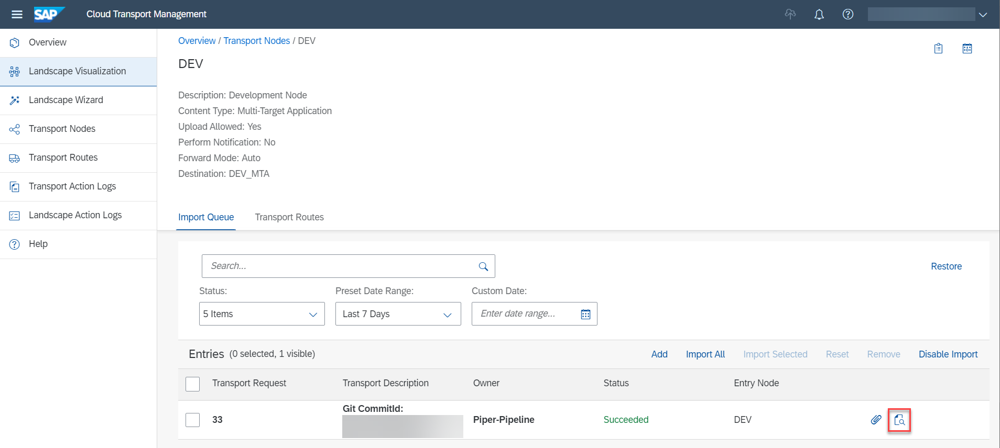

# Exercise 4 - Perform imports with SAP Cloud Transport Management

In this exercise, you will trigger the import of a transport request which has been created by the job from the SAP Continuous Integration and Delivery service. We will check the outcome of the import and the automatic forwarding of the transport request to the next node on your transport route.

## Exercise 4.0 - Start the Import to Your Development Subaccount

1. In the SAP BTP cockpit, navigate to the subaccount in which you’ve created an instance for SAP Cloud Transport Management.
2. From the navigation area, choose **Instances and Subscriptions > Cloud Transport Management**.
3. Navigate to **Transport Nodes**.
4. Choose the row with the first node in your transport route. It is called **DEV** if you followed our proposed naming convention.
5. An import queue of the transport node *DEV* is displayed showing the new transport request and a description starting with *Git CommitId:*.
6. To start the import into this node, select the checkbox at the beginning of the row and choose **Import Selected**.
7. A confirmation dialog window appears. Choose **OK**.
The import starts and runs for a few minutes.
8. The application is released to the node. The import **Status** for the transport request changes to **Succeeded**.

## Exercise 4.1 - Check the Transport Log

1. In SAP Cloud Transport Management, choose the magnifying glass icon on the right of the table to display a detailed log of the import process. 
2. To close the log display, choose **Close**.

## Exercise 4.2 - Verify Succesful Deployment

1. In your **Test** subaccount, go to **HTML5 Applications**.
2. You will find two new applications **sapfecaptravel_anayltics** and **sapcaptravel**.
3. Click on one of them to open the UI.

**Congratulations!**

This concludes the exercises of this hands-on workshop.
