# Exercise 4 - SAP Alert Notification service for SAP BTP in Action

Within this use tutorial you will learn how to set up proactive alerting and incident management for SAP BTP applications using SAP Alert Notification service.


**IMPORTANT:**
In this exercise it is covered a particular use case: "Alert Notification service - Immediate alert for an app crash on CloudF oundry". 
However, please be informed there are also many more use cases related to Alert Notificaiton service - to find out more detauls, please consult the service documentation: [SAP Alert Notification Service Events](https://help.sap.com/docs/alert-notification/sap-alert-notification-for-sap-btp/sap-alert-notification-service-events)


## Context

> [!NOTE]
> Before proceeding with configurations within SAP Alert Notification service it is important to understand the context behind it. 

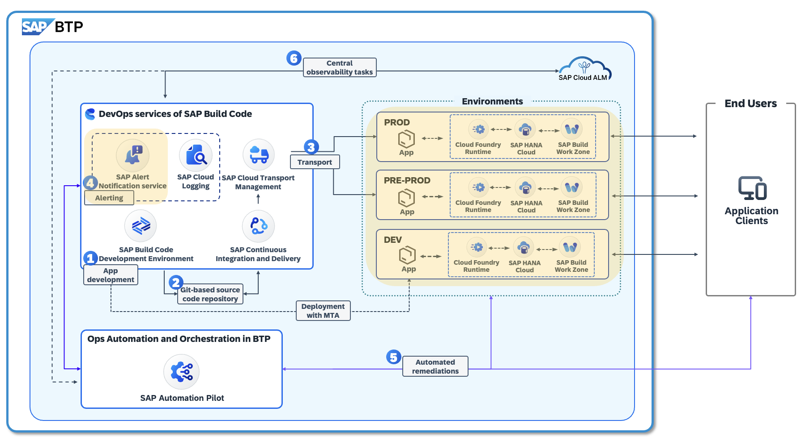

The diagram above is explained as it follows: 
- there is a cloud (CAP) app already deployed and running on BTP CF in your subaccount;
- in case there is a crash of this app or other events of our interest, these events will be ingested into Alert Notfiication service;
- in order to be able filter and act on the events ingested into the Alert Notification service it is needed to configure: `conditions` (needed to filter out the events which are important for you) , `actions` (specify  actions to be triggered by the Alert Notification service, e.g. send email, send IM notification, trigger HTTPS webhooks, trigger automation flow, etc), and set `subcription` (which is the entity that binds one or more conditions to one or more actions that have been already set). IMPORTANT: without an active `subcription` no action will be triigered by Alert Notification service.

# Provisioning of SAP Alert Notification service

First, you will need to provision SAP Alert Notification service for SAP BTP in your SAP BTP subaccount.

Go to your subaccount and on the left sidebar click the menu item “Entitlements” and you will see the entitlements set. 

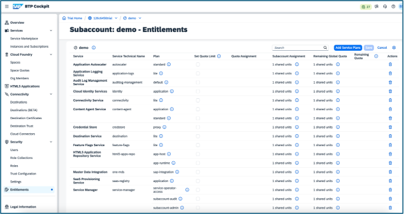
 
## Provisioning of SAP Alert Notification service

First, you will need to provision SAP Alert Notification service for SAP BTP in your SAP BTP subaccount.

Go to your subaccount and on the left sidebar click the menu item “Entitlements” and you will see the entitlements set. 


Click on “Add Service Plans” button . 

Find Alert Notification service and check the “standard” within the available plans section and click “Add 1 Service Plan” to save the configuration. 


Click on “Save” button to save the configuration you made. 
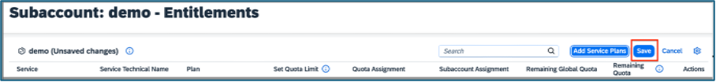


As an expected result you shall be able to see the Alert Notification service with plan “standard” added into your entitlements. 
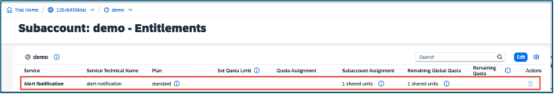


Let’s proceed with the service provisioning. 

At subaccount level, click on “Instances and Subscriptions” main menu item, followed by the button “Create”
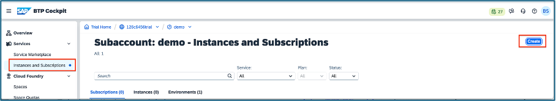


A multi-step wizard is to be displayed needed to be completed to provision Alert Notification service. 
Fill in the needed fields with the basic info screen and click on “Next” button: 
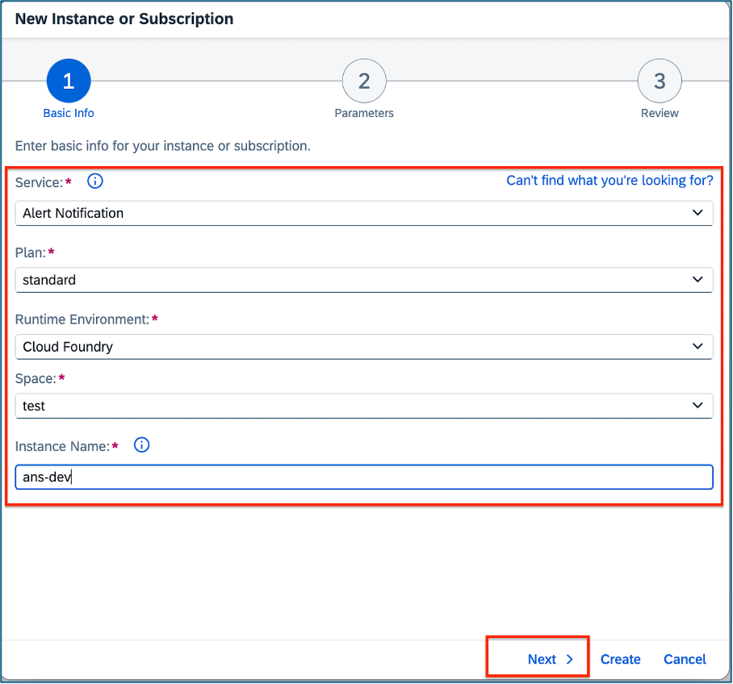


You will see “Parameters” section from the wizard, as some services support the provisioning of additional configuration parameters during instance creation. These parameters are passed in a valid JSON object that contains service-specific configuration parameters, provided either in-line or in a file.

As per the Alert Notificaiton service documentation - [Cloud Foundry Audit Events](https://help.sap.com/docs/alert-notification/sap-alert-notification-for-sap-btp/audit-events) -->  [Application Events](https://help.sap.com/docs/alert-notification/sap-alert-notification-for-sap-btp/application-events) , in order to receive Cloud Foundry application events, you need to update the relevant SAP Alert Notification service instance with parameter `enableCloudControllerAuditEvents` set to true.

Therefore the following parameters shall be prvoided. 

```
{ "enableCloudControllerAuditEvents": true }
```

Add this parameter and click “Next” 
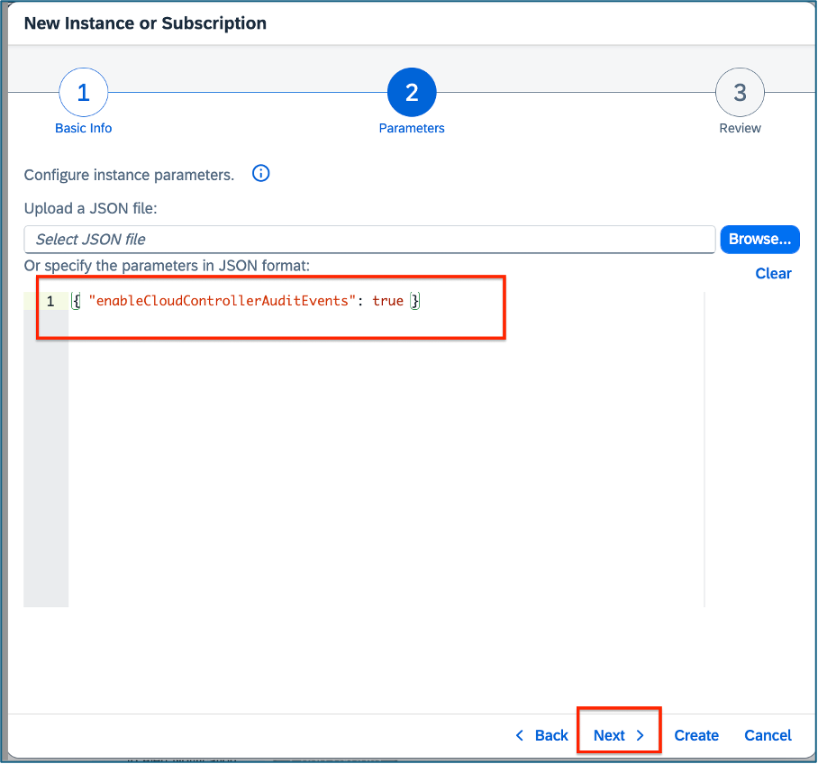

Review the configuration and click the “Create” button to kick-off the provisioning of the service itself. 
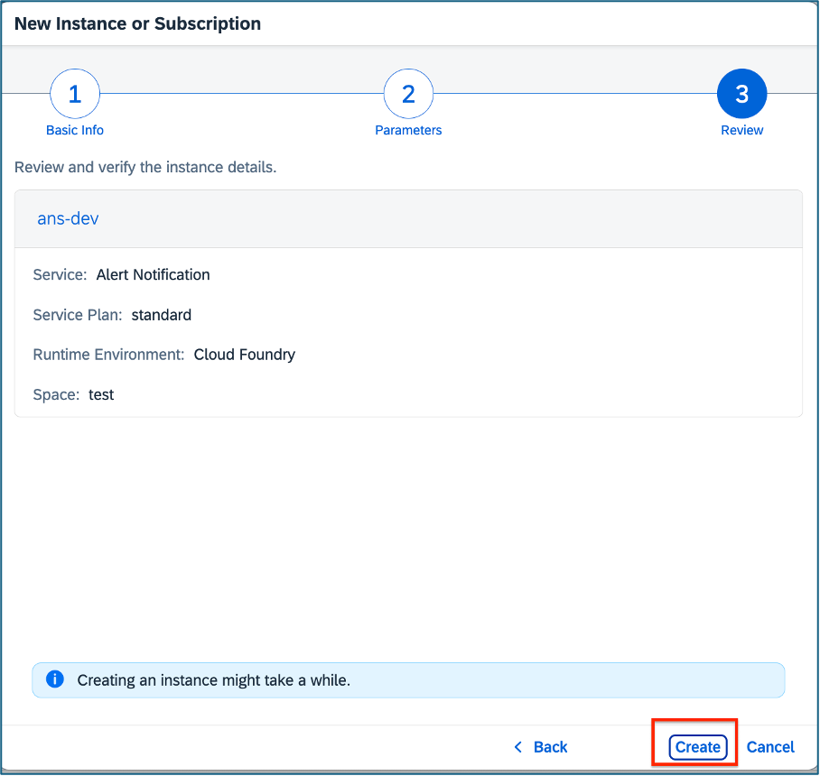

You will see the service creation is in process: 
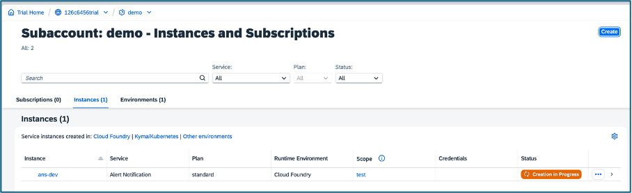


After a successful completion of the service provisioning you shall be able to see the service “Alert Notification” with a status “Created” as depicted in the screenshot below: 
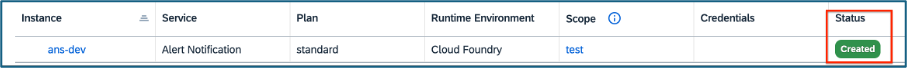

To access the Alert Notification service just click on the hyperlink within the service instance: 
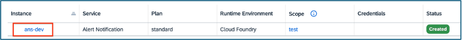

You shall be redirected to the Alert Notification service UI as per the screenshot below: 
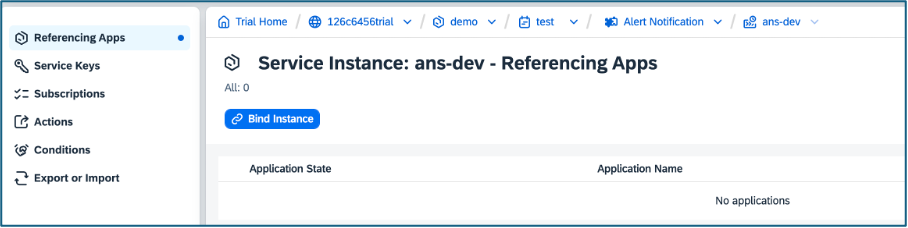


## Configuring Alert Notification service

To consume events for our CAP applications in case of disruption or other potential incidents, there is needed to have an active subscription configured in Alert Notification service. 

To create the subscription, follow these steps: 
Click on the “Subscriptions“ menu item and then “Create” button. 
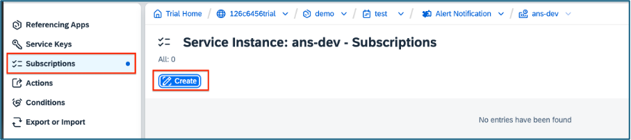

A multistep wizard named “Create Subscription” is to be displayed. Fill in the fields, as a reference check the screenshot attached underneath: 

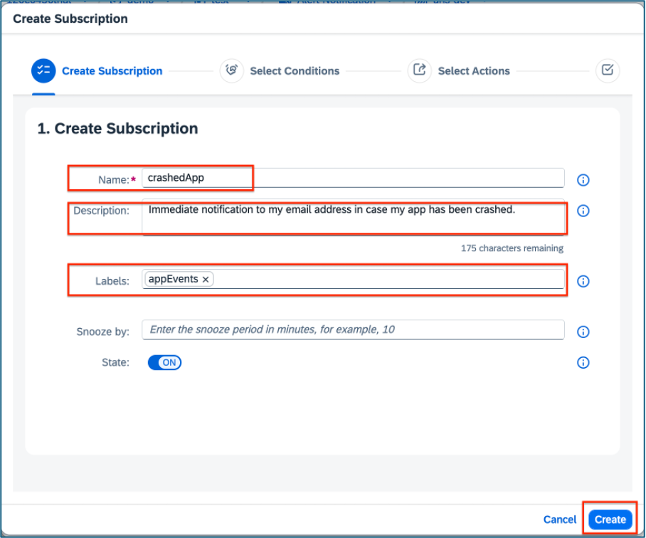


Make sure the state is set to “On” and click “Create” button which will lead to the “Select Conditions”. Since there are not any conditions, click on “Create Condition”
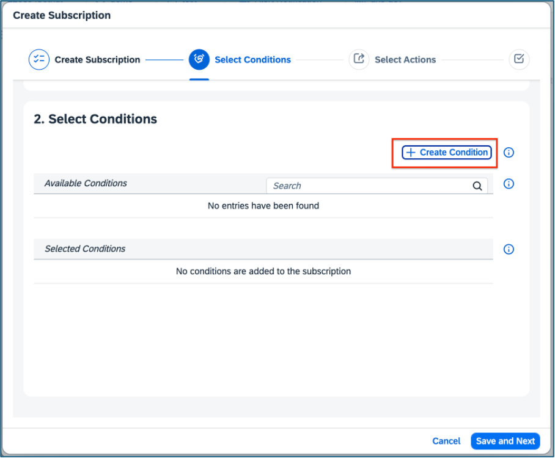

That will open the section so that you can create your first condition in Alert Notification service. Fill in the fields as suggested below. Note: it is important to make sure that for the condition in question there is assigned a property that you want matched, including a predicate and expected value. Therefore, within the current example we want to be able to detect events about crashed events and therefore the condition is configured as: 

`eventType` `Contains` `app.crash`

**HINT**: to identify unique parameters which you could use to setup the needed conditions in Alert Notification service, you can consult the various events consumed in Alert Notification service. If we take the example of a CF crashed app, you can check out the parameters available in this event: Application Crash: https://help.sap.com/docs/alert-notification/sap-alert-notification-for-sap-btp/application-crash 
See some examples of the event properties below: 
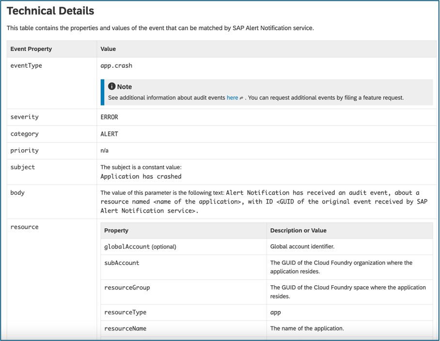


Once it is all set click on the “Create” button to create the condition. 
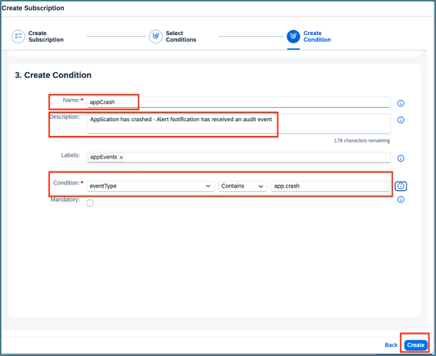

You can find out that the condition is already associated to the subscription. 
Then click on “Save and Next” to proceed further. 
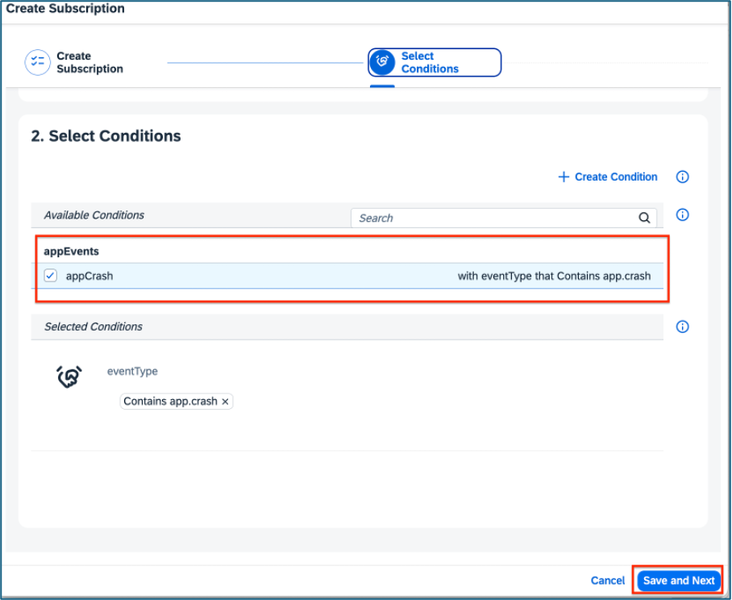


As a next step you will need to create an action that is going to be associated to your active subscription. Note: this action is going to be triggered in case the condition you just have created has been matched. 

To create the action, click on the option “Create Action”:
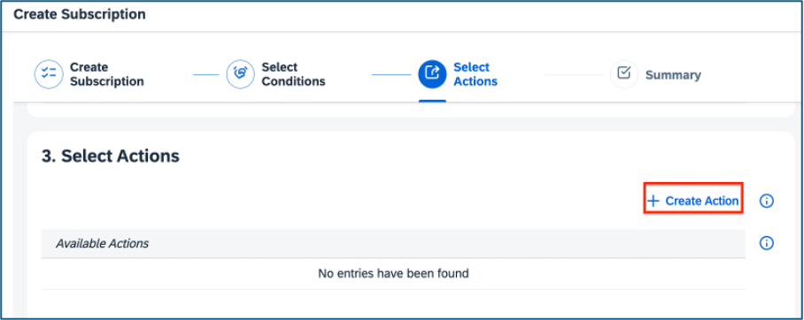

A list of possible actions is to be displayed. For this use case we’ll go with an email action. Select the “Email” and click at the “Next” button. 
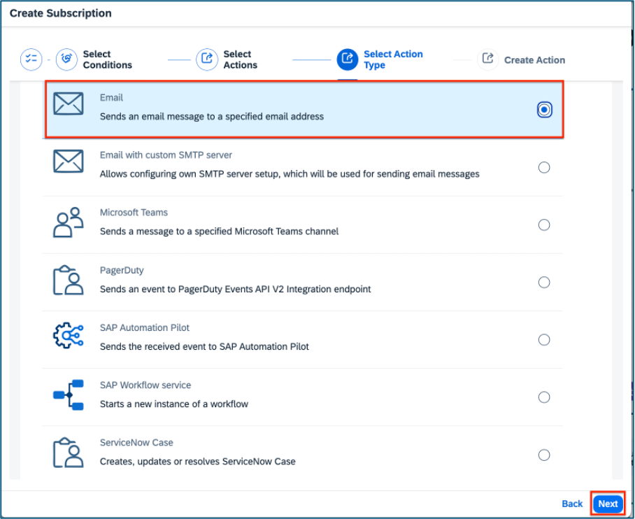


Fill in the fields requested and provide the email to which an alert is going to be sent out. Once you are done with it, click on the “Create” button: 


You shall be redirected to the Select Actions where the action that has been just created is associated to the subscription. Please click “Save” to proceed further: 
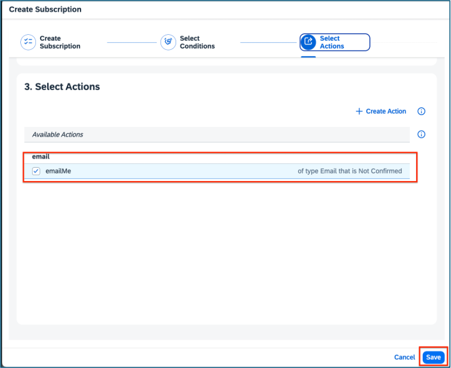

Congratulations, your first subscription in Alert Notification service has been created: 
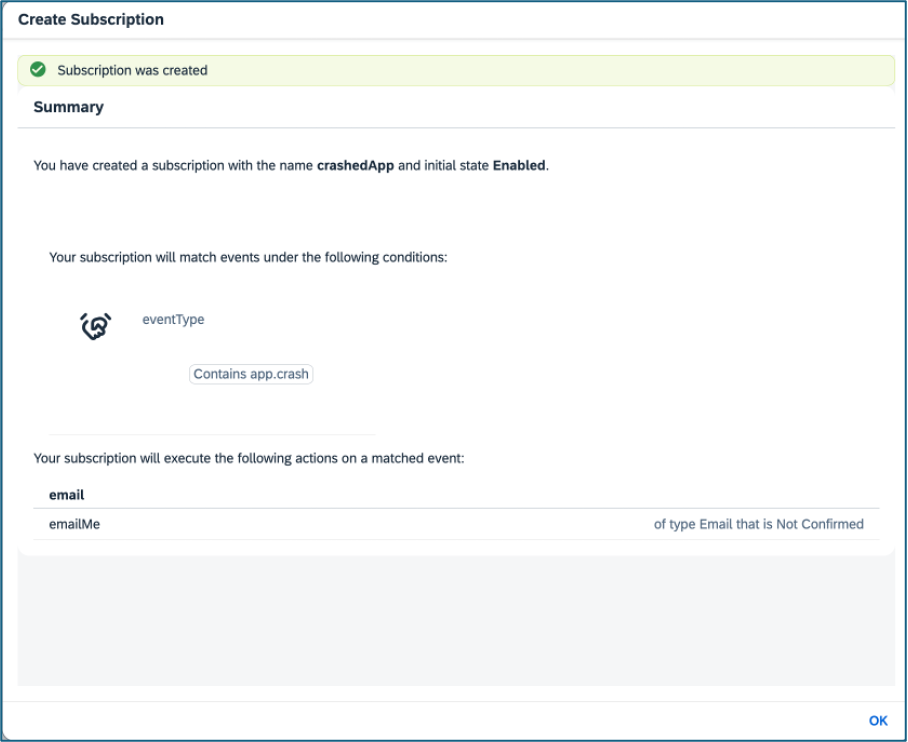


You shall be redirected to Subscriptions page in Alert Notification service where you can find your subscription available. 
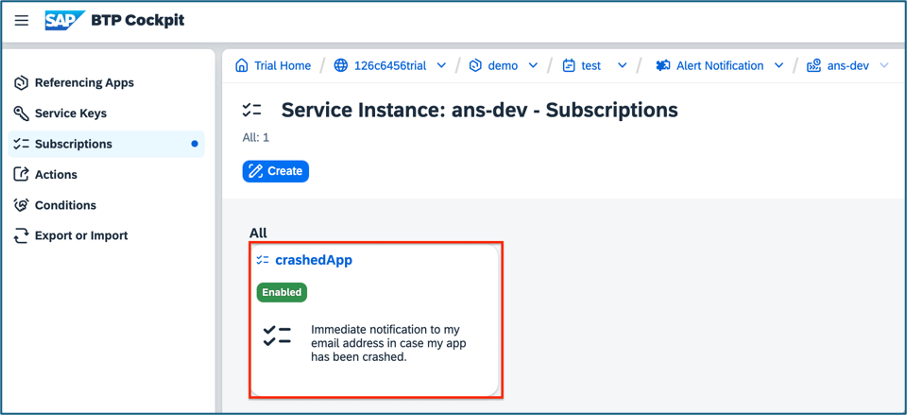


### Email Confirmation 
> [!NOTE]
> Before proceeding further, please check your inbox. You shall get an email in your inbox to confirm manually the email you had provided in the action `emailMe` you had created. Please read the email and click on the link provided to confirm your email otherwise you won’t receive notifications from Alert Notification service. 
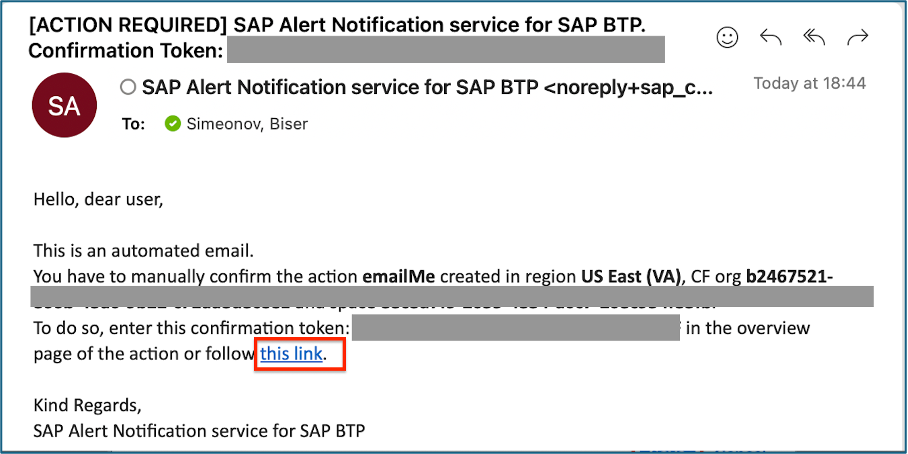


Once you have clicked on `this link` you will be redirected to a confirmation page in your browser. Click on `Confirm` button: 
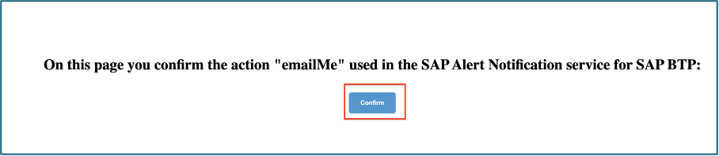

Then you will see a confirmation page in your browser: 
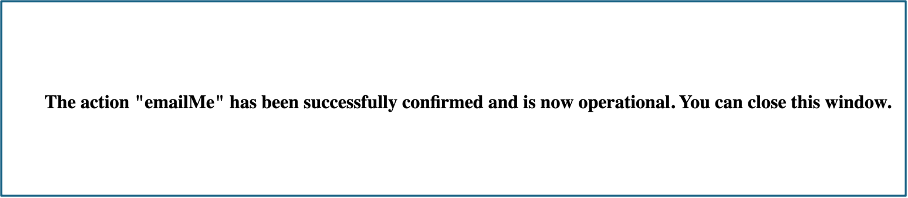

Now you are all set, and you could receive instant notification from Alert Notification service delivered directly in your email inbox. 


## Simulating a crash of your CAP application and receiving an instant alert 

Since we have created already a subscription in Alert Notification service to detect potential crashes in our CAP app and notify us immediately over an email, let’s now simulate such situation. The exact simulation would be to cause a situation where the app runs out of memory and crashes. 

To do so, please access your service CAP application ` sflight-srv` running in your Cloud Foundry dev space by just clicking on it: 
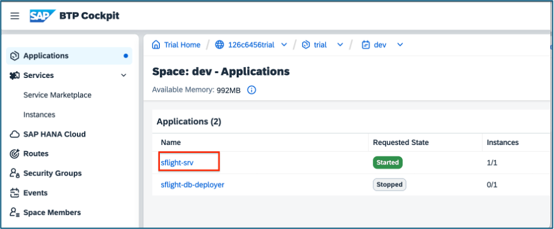


At the Application Overview page, click on the “Change Instance Details”: 


Then change the instance details by setting up the `Memory per Instance (MB)’ to 5 , checked the consent  “I understand that changing the instance memory or instance disk of "sflight-srv" will cause the application to restart” and click “Save” to save the configuration. 

The newly applied configuration would case a crash of your CAP app with an error: `exited with status 137 (out of memory), reason: CRASHED`
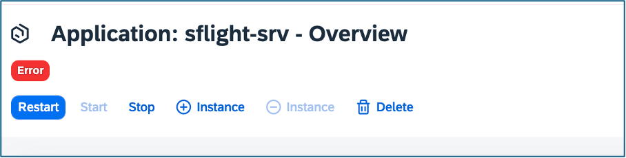


As an expected result out of this exercise you should get an instant email in your email inbox with details about the event and the CAP app itself: 
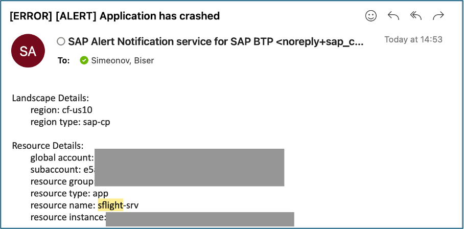


Now you can consider that the instant alerting for your CAP app is in place, and you will be always notified in case of app crashes. 


## Simulation and Outputs 

Now it is time to simulate the use case and inspect the outputs. To do so , please follow these steps: 


---

## Summary

You've now managed to see Alert Notification service in action. With its flexible events' filtering combined with a rich catalog of actions that can be triggered automatically, the Alert Notification service is a solid product, valuable for each (Dev)Ops team that can be used in a wide variaty in use cases.


