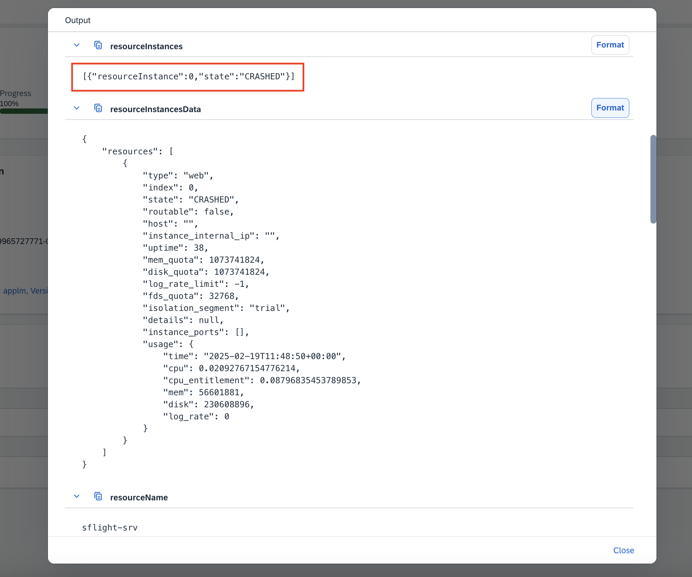
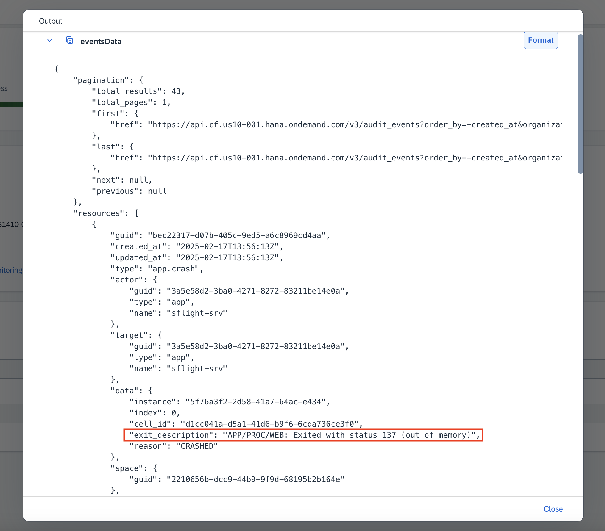

# SAP Automation Pilot
The goal of SAP Automation Pilot is to simplify and automate complex manual technical processes and flows. This enables DevOps teams to run their solutions on SAP BTP with minimal operational effort.

## SAP Automation Pilot is a low-code / no-code automation engine that allows you to:
- Automate sequences of steps,
- Execute scripts in a serverless manner,
- Use catalogs of commands provided by SAP to automate typical Ops tasks in and outside your SAP BTP landscape,
- Build custom automations.

Automations in SAP Automation Pilot can be triggered in various ways to best fit your operational needs - manually by the DevOps team, through the built-in scheduler, automatically via integration with services and ops platforms like SAP Cloud ALM, or by other applications and systems.

The service is designed to work with low latency, even under a heavy workload, and is capable of triggering hundreds of automations simultaneously.

## Use Case Implementation
To implement the desired solution, complete the following steps (use the links to explore the actions in detail):
- Integrate SAP Alert Notification service for SAP BTP with SAP Cloud ALM and activate the switch in SAP Cloud ALM for "SAP BTP: Application Crash".
- Integrate SAP Automation Pilot with SAP Cloud ALM.
- Configure SAP Alert Notification service for SAP BTP to start collecting the application audit events for Cloud Foundry.
- Create an automation flow in SAP Automation Pilot to enable an automated response to the potential app crash. Execute the following steps:
- Use content from the provided catalogs to get the latest app state and the most recent 20 events kept for your Cloud Foundry application. Consider using the commands "GetCfAppState" and "GetCfAppEvents";
- Model a custom command to fetch the last 100 lines from the application’s log file;
- Trigger the automation flow in SAP Automation Pilot created in the previous step.

### Result
By following the steps outlined above, you have implemented a comprehensive, end-to-end solution for automated incident response in your cloud application on SAP BTP. This solution not only detects and alerts you about issues but also automatically triggers recommended actions for troubleshooting and incident management. By structuring and automating the incident response process without the need for human intervention, you ensure faster problem resolution, more efficient project delivery, and higher client satisfaction.

---

## Table of Contents

- [2. SAP Business Technology Platform Configuration](#2-sap-business-technology-platform-configuration)
- [3. SAP Automation Pilot User Interface](#3-sap-automation-pilot-user-interface-🎨🖌️)
- [3.1. Command Creation Process](#31-command-creation-process)
- [Create Input Keys](#create-input-keys)
- [Create Executors](#create-executors)
- [3.2. Inputs Page Overview](#32-inputs-page-overview)
- [4. Configuration Before Testing the Command](#4-configurations-before-testing-the-command-⚙️)
- [4.1. SAP Automation Pilot Configuration](#41-sap-automation-pilot-configuration)
- [4.2. SAP Alert Notification Service Configuration](#42-sap-alert-notification-service-configuration)
- [5. Testing the Integration](#5-testing-the-integration-👩🏻‍🔬)

---
  
## 2. SAP Business Technology Platform Configuration

### Booster Showcase
  - The booster helps you get started in a faster manner by ensuring the subscription and the role assignment to your user for SAP Automation Pilot is done automatically.

#### Ensure you have entitlements to create a subscription and assign yourself the necessary role and permissions

#### Region Availability
  - The regions where SAP Automation Pilot are available are shown in the [documentation here](https://help.sap.com/docs/automation-pilot/automation-pilot/what-is-sap-automation-pilot?locale=en-US&q=dynamic+expressions).
  > [!IMPORTANT]
  > A subAccount for AP21 must be created for trial accounts.

#### Prerequisites for access!
  - Verify that your user has the necessary access in the subAccount, Cloud Foundry organization, and Cloud Foundry space with the appropriate roles.
  > [!WARNING]
  > The demo does NOT support MFA enabled users! It can be extended to support it, but that is not the focus of it.

---
  
## 3. SAP Automation Pilot User Interface 🎨🖌️

### Commands Page Overview
Become familiar with the Commands page, where you manage and create new commands.

### 3.1. Command Creation Process
Create a robust command with input and output keys to define the command contract and executors for the different steps you want to perform.
- The scenario assumes that your command is named **ResizeAppWhenCrash** and resides in a catalog named **EDay**.

- **Command Contract**: Defines the input and output keys, which is the input data for the command and the output data from the command respectively.
  - Input key names are used to pass data around in the command;
- **Command Executors**: Configure steps and their specific settings, which form the execution logic of what you want the command to accomplish.
  - Executor steps have a field **alias**, which is the particular name for that specific step in your command. It has to be unique for your command, because it is used to access the output from that particular step.
  - Configurations and data manipulation can be achieved by using the custom jq expression language that SAP Automation Pilot supports. (It deserves a [documentation link](https://help.sap.com/docs/automation-pilot/automation-pilot/dynamic-expression?locale=en-US&q=dynamic%20expressions) on its own, as it will be your helpful reference.).

#### Create Input Keys

- **Input Key Names and Types**: Input key names and their type are CRUCIAL to match exactly, because automatic mapping of expressions and values from events depend on them.
- **Exports/Imports Showcase**: This is one way you can store the content you create in external version control systems for backup purposes.

> [!TIP]
> Checkpoint 1/4: [Command contract](assets/checkpoint_1-commandContract.json)
  

#### Create Executors
  - Add **GetCfAppState** step to check the state of our application with alias *getAppState*;
    - Make sure *Auto-map parameters* toggle is on when adding the executors;
  - Add **GetCfAppEvents** step to identify if Out-Of-Memory errors cause the issue with alias *getAppEvents*;
    - Add a conditional execution on whether any instance of our application is in CRASHED state:
    >  
    > `$(.getAppState.output.resourceInstances | filter(.state == \"CRASHED\") | length > 0)`
    
     
    
    
    
     
  - Add **SetCfAppResources** step to resize the application's memory allocation with alias *setAppResources*;
    - Add a conditional execution on whether the previous step contains the OOM error: `Exited with status 137 (out of memory)`
    > `$(.getAppEvents.output.eventsData | toObject.resources | map(.data.exit_description))`
    - Calculate the memory to use based on the previous value from the *getAppState* step with 1MB added:
    > `$(.getAppState.output.memory + 1024)`

     
    
    
    
     
  - Add **RestartCfApp** step to restart the application in order for the changes to take effect with alias *restartApp*;
    - Add a conditional execution on whether the app state is STOPPED or the resizing was executed:
    > `$(.setAppResources.executed)`

> [!TIP]
> Checkpoint 2/4: [Working command](assets/checkpoint_2-workingCommand.json)
  

### 3.2. Inputs Page Overview

#### Create the Input
Inputs are used to store static data instead of repeatedly typing it every time we want to trigger a command. In this example your user email and password are such static data.

#### Add Default Values
- Add a key named **user** of type *string* and enter your user's email you use for access to the Business Technology Platform.
- Add a key named **password** of type *string*, mark it as **sensitive** and enter your user's password. 
> [!NOTE]
> MFA must NOT be enabled for this demo to work! Otherwise the OTP code must be appended to your password.

> [!TIP]
> Checkpoint 3/4: [Input with <PLACE_HOLDERS>](assets/checkpoint_3-inputResource.json)
  

#### Command configuration final touches 🤌🏻
Head back to our command to configure its last part - to automatically use our newly created input for default values.

- Click on Edit for the input keys and configure the default values for the keys *user* and *password*

> [!TIP]
> Checkpoint 4/4: [Working command with input key references](assets/checkpoint_4-workingCommandWithReference.json)
  

---
  
## 4. Configurations Before Testing the Command ⚙️
The command can be triggered in many ways: manually, via schedule, but for the purposes of this demo we will use SAP Alert Notification Service events.

---

### 4.1. SAP Automation Pilot Configuration

### SAP Automation Pilot Service Account Creation
  - Create a service account in SAP Automation Pilot in order to give access for external systems.
    - Use the ROBOT suffix;
    - Select Basic authentication;
    - Add "Execute" permissions;
    - Click on create and store credentials securely for later use.

### Create a Trigger Endpoint:
  - Create an SAP Automation Pilot trigger endpoint for external systems to call.
    - Select the command to create a trigger url for.

    > [!NOTE]
    > Some of the event fields (like *subAccount*, *resourceGroup*, *resourceName* and *resourceInstance*) can be auto-mapped, [reference here](https://help.sap.com/docs/automation-pilot/automation-pilot/reacting-to-events?locale=en-US&q=notification).
    - Then copy the endpoint URL and store it for later use.

---

### 4.2. SAP Alert Notification Service Configuration

- **Configuration of SAP Alert Notification Service in Business Technology Platform**:
  - Reuse the "Condition" for the event crash from the previous demo.
  - Create an "Action" of type SAP Automation Pilot to indicate we want to trigger our command.
    - Use the service account credentials and trigger URL from before to configure it.
  - Reuse the "Subscription" from the previous demo to include our newly created "Action".

---
  
## 5. Testing the Integration 👩🏻‍🔬

### Open the Executions Page
If the entire setup was prepared correctly, then only one thing will guarantee it - testing it with a real event! Head to the SAP Automation Pilot Executions page to await the start of the command in response to the crash event from the SAP Alert Notification Service.

- **Crash the Application**: Test the event integration by simulating an application crash.
  - SAP Alert Notification Service will trigger an event, activating your SAP Automation Pilot command.
- **Verify Successful Execution**: Ensure the command execution completes successfully.
- **Verify in Business Technology Platform**: Confirm the application has been resized and gets restarted.
> [!IMPORTANT]
> An integration between SAP Automation Pilot and SAP Alert Notification Service in the other direction is also possible, but it is not showcased in the demo. Link to [documentation for further information here](https://help.sap.com/docs/automation-pilot/automation-pilot/integrate-with-sap-alert-notification-service-for-sap-btp?locale=en-US&q=notification).

---
  
This concludes the Enablement Day session for SAP Automation Pilot. Make sure to check out additional resources and support options provided. Thank you for participating! Awesome work 😎
